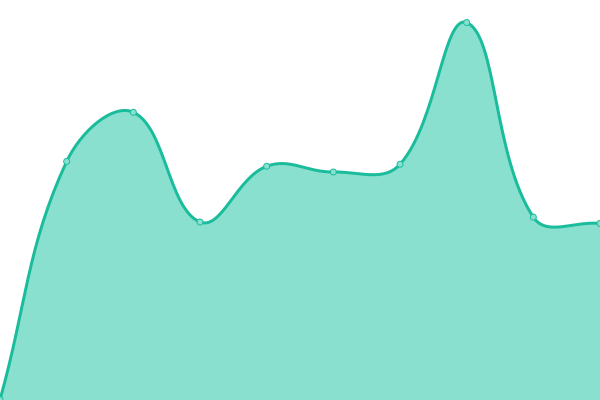
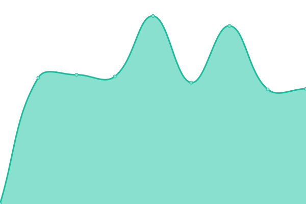

# [📈 Live Status](https://aureooms.github.io/monitor): <!--live status--> **🟩 All systems operational**

This repository contains the open-source uptime monitor and status page for [Aurélien Ooms](https://aurelienooms.be), powered by [Upptime](https://github.com/upptime/upptime).

With [Upptime](https://upptime.js.org), you can get your own unlimited and free uptime monitor and status page, powered entirely by a GitHub repository. We use [Issues](https://github.com/aureooms/monitor/issues) as incident reports, [Actions](https://github.com/aureooms/monitor/actions) as uptime monitors, and [Pages](https://aureooms.github.io/monitor) for the status page.

<!--start: status pages-->
<!-- This summary is generated by Upptime (https://github.com/upptime/upptime) -->
<!-- Do not edit this manually, your changes will be overwritten -->
<!-- prettier-ignore -->
| URL | Status | History | Response Time | Uptime |
| --- | ------ | ------- | ------------- | ------ |
|  [Personal Homepage](https://aurelienooms.be) | 🟩 Up | [personal-homepage.yml](https://github.com/make-github-pseudonymous-again/monitor/commits/HEAD/history/personal-homepage.yml) | 

 617ms
     
 | 

<a href="https://make-github-pseudonymous-again.github.io/monitor/history/personal-homepage">99.66%</a>
    

|  [Academic Homepage](https://research.aurelienooms.be) | 🟩 Up | [academic-homepage.yml](https://github.com/make-github-pseudonymous-again/monitor/commits/HEAD/history/academic-homepage.yml) | 

 1037ms
     
 | 

<a href="https://make-github-pseudonymous-again.github.io/monitor/history/academic-homepage">99.67%</a>
    

|  [Blog](https://blog.aurelienooms.be) | 🟩 Up | [blog.yml](https://github.com/make-github-pseudonymous-again/monitor/commits/HEAD/history/blog.yml) | 

 793ms
     
 | 

<a href="https://make-github-pseudonymous-again.github.io/monitor/history/blog">99.67%</a>
    

|  [Math Blog](https://math.aurelienooms.be) | 🟩 Up | [math-blog.yml](https://github.com/make-github-pseudonymous-again/monitor/commits/HEAD/history/math-blog.yml) | 

 851ms
     
 | 

<a href="https://make-github-pseudonymous-again.github.io/monitor/history/math-blog">99.68%</a>
    

<!--end: status pages-->

[**Visit our status website →**](https://aureooms.github.io/monitor)

## 📄 License

- Code: [MIT](./LICENSE) © [Aurélien Ooms](https://aurelienooms.be)
- Data in the `./history` directory: [Open Database License](https://opendatacommons.org/licenses/odbl/1-0/)
